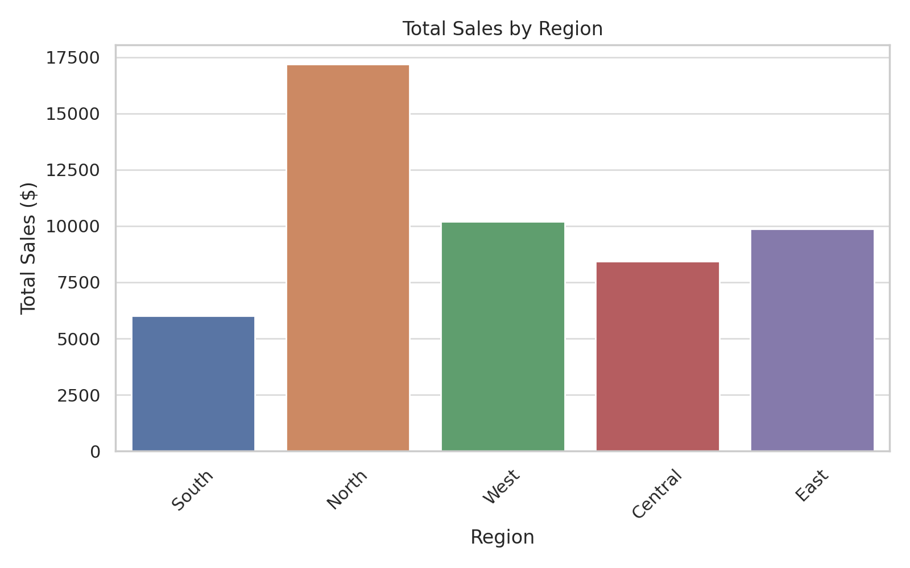
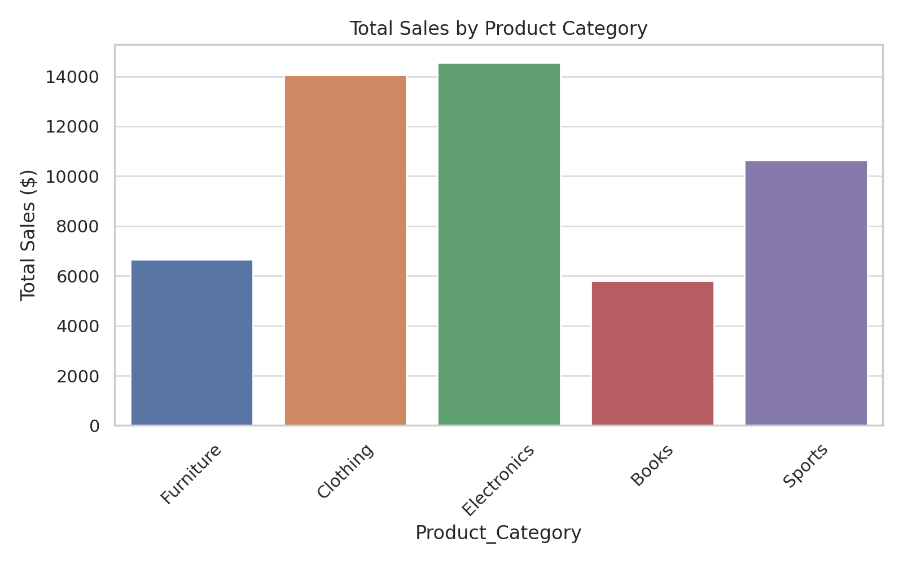
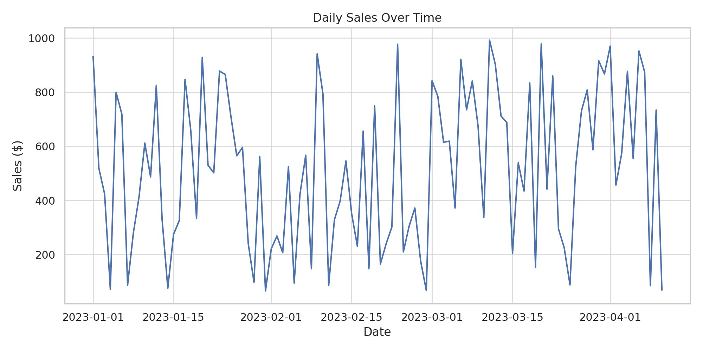

# Customer Sales Analysis

A portfolio project analyzing customer sales data to uncover trends, product performance, and regional insights using Excel, Power BI, and SQL.

## 📊 Tools Used
- Excel
- Power BI
- SQL

## 📁 Dataset Description
This dataset contains 100 entries of fictional customer sales across different regions, product categories, and dates. Columns include:
- Customer_ID
- Region
- Product_Category
- Sales_Amount
- Purchase_Date

## 🔍 Methodology
1. Cleaned and transformed data using Excel.
2. Used Power BI to build interactive dashboards.
3. Created charts for:
   - Total Sales by Region
   - Total Sales by Product Category
   - Daily Sales Over Time
4. Queried and grouped sales using SQL for deeper insight.

## 📈 Visuals

  
*Total sales amount grouped by region.*

  
*Total sales by different product categories.*

  
*Line chart showing sales performance over time.*

## 💡 Key Insights
- Central region accounts for the highest sales (~35%).
- Electronics and Furniture lead in revenue generation.
- Sales peaked mid-year; potential seasonality impact.
- Opportunity to target underperforming regions through campaigns.

---

👤 **Created by:** Solape Olojede  
📅 **Date:** April 2025  
🔗 **GitHub:** [Lapemye](https://github.com/Lapemye)
